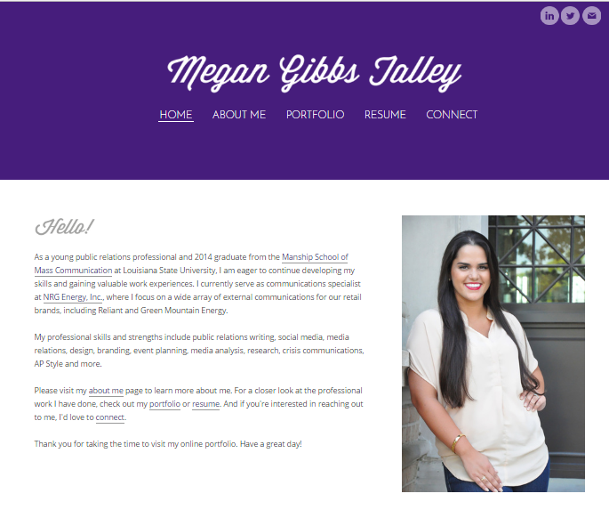
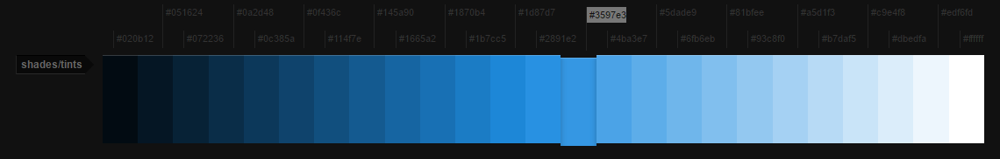
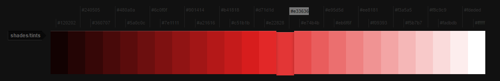
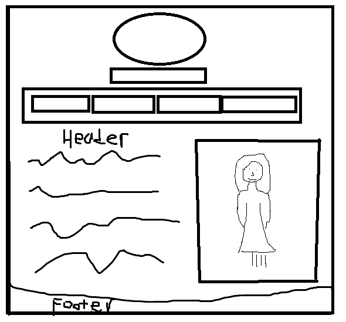
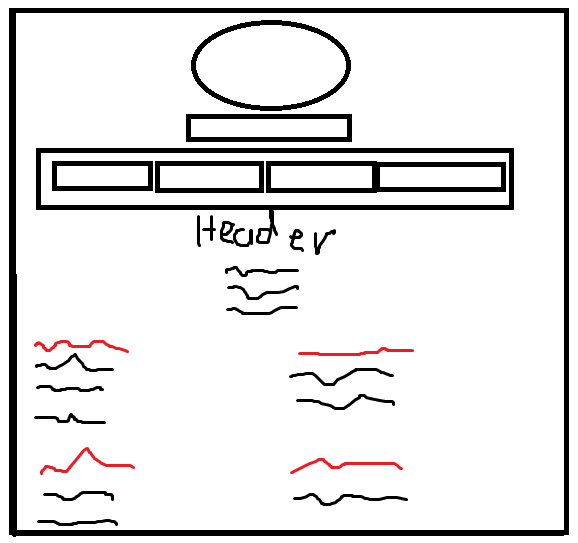
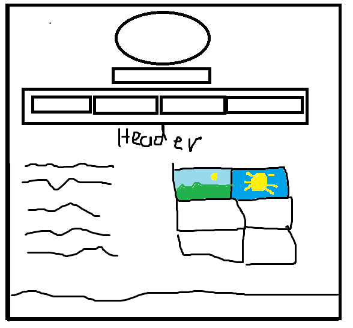
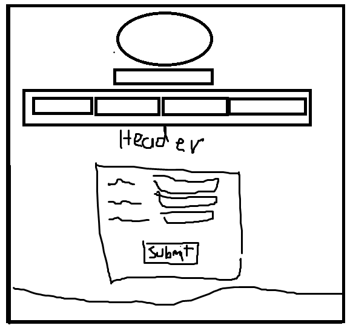
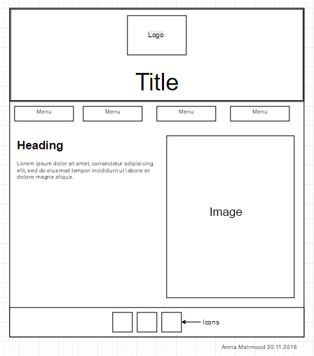

#### Student Name: Amna Hira Mahmood    Student ID: 16433342
# csy1018-assign1

## Work description and development

While making my Digital Portfolio I had to go through a lot of stages and decisions in order to come up with an idea on how to design my website. I first visited different portfolios. Here are some links for them: http://www.megangtalley.com/connect.html, http://www.andyhau.com/, http://mikekus.com/.

The only portfolio that I liked the most was the "Megan Talley" one. Below you can see an image of the Megan portfolio and a description of what attracted me the most.

This is a screenshot of the homepage. What attracted me was the layout and the menu of it, it is very simple and makes the content clearly visible. Where you can see the title, I inserted my Logo there and then the Menu is below that. However I used a different color scheme,  

## Color-scheme ##

To select the correct color scheme for my website, I checked a lot of sites which provided me RGB colors and the one that I found easy was "http://colllor.com/3597e3" I selected a blue color which provided me all the different shades I could use in designing my site. Below you can see what Colors shades I used for the layout.

For the menu I used a shade of red color, I wanted the menu to look different. I added the hover effect as well. When the user would hover the mouse over the shade will turn lighter.

## My Logo ##

I made my Logo using Photoshop software working through different Layers, and I kept the background transparent so when I was going to save it in PNG format, the white background was not visible. The color scheme was black and blue, I kept it blue so it would match the color of my website. My logo has my Name initials on it "Mahmood Amna Hira" Below you can see my Logo with "MAH" written on it.

## Google Fonts ##

I wanted my website font to be stylish so I used two google fonts. I had to select a couple first to come up with the right decision at the end. I tried 3-4 fonts and at the end I only liked "Sofia" and "Trocchi", so I used Sofia for all the headings and for the body font I used Trocchi font. Also the font size changes when the website is turned to mobile version, I added this feature because if the screen is smaller the text should be also smaller.

## Sketches

#### Homepage (index.html) ####

#### Homepage (cv.html) ####

#### Homepage (bio.html) ####

#### Homepage (contact.html) ####

## Mockups/Wireframes

#### Homepage (index.html) ####

This is the wireframe I made for the Homepage, it is very simple. Where it says "image" there I will be placing my own image, and below heading I will write a short description about me. I will also add icons on the footer of my Facebook, Instagram and Twitter where people can follow me to know more about me. And the logo will be situated at the top in the middle of the screen, below the Logo I will be typing my name "Amna Hira Mahmood".
I will be adding a flex box of two columns in the middle of the screen where there is image and text so it will make it easier for me to add a media query later to make my website responsive.

#### Homepage (mobile version) ####

In this mobile version of my homepage as you can see the screen is less wide now and the height of the page is gone longer, this is because the user with this design can open the site on a mobile as well and scroll down the page to view the content easily. I will be performing this through adding a media query and by making the flex-box from "row" to one "column". Everything else will stay the same just the layout will be changing.

#### Biography page (bio.html) ####

In the biography page I will be adding the information about me, and I will also add 4 images on the left. The layout of the site will stay pretty much the same as the homepage. The content that doesn't change is the menu, header, and footer. They don't change in any page of the website. In the biography text I will be adding links to the contact page, just to make it more interactive with the user because reading long text can be boring this is why I will try to keep my biography short.

#### Biography page (mobile version) ####

I added a flexbox and media query in this the page as well to make it suitable for the mobile version, the layout will be just like the first page.

#### CV page (cv.html) ####

#### CV page (mobile version) ####

#### Contact page (contact.html) ####

#### Contact page (mobile version) ####

## Test plan ##

Now that my website is ready I am going to test it, I have made the test plan below where I will be recording what is completed and what has gone wrong.

  | Test | Expected Result | Actual Result | Pass/Fail | Date | Action? |
---------------|------|-----------------|---------------|-----------|------|---------|-
1 | File structure? | The file structure should be the same as it is stated in the assignment brief.| Yes the file structure is the same as it says on the brief. | Pass | 28.12.2016 | None
2 | Repository on github | There should be a repo available on github with name csy1018-assign1 | Yes there is a repository available on github. | Pass | 28.12.2016 | None
3 | Git commit 5-10 times | I should have committed from 5 to 10 times at least while building my site | I have committed 6 times so far, and I will make a few more commits as well. | Pass | 28.12.2016 | I need to commit couple more times
4 | Images available | There should be at least one image available on the website and they should be visible | Yes I have added 5 images on my website, however one is not visible in the browser. | Fail | 28.12.2016 | I need to fix the code for the image that is not visible
5 | Icons available | There should be icons available on one site at least | There are icons available however, one icon displays twice. | Fail | 28.12.2016 | I need to recheck the code and make sure all the icons are visible only once.
6 | CV well structured | The CV should have the right structure as it is said in the brief | Yes the CV structure meets the requirements | Pass | 28.12.2016 | None
7 | Biography available | There should be a page with biography well written, with no mistakes | Yes there is a bio page available with correct content | Pass | 28.12.2016 | None
8 | Menu nav bar | The menu should be available on each page to make the navigation easier, with 4 buttons only | Yes the menu is available on each page with correct buttons | Pass | 28.12.2016 | None
9 | ReadMe file | There should be a readme file available with a worklog, brief explanation and wireframes | I have a readme file with all the content needed | Pass | 28.12.2016 | None
10 | Wireframes/sketches | I should have made some sketches and wireframes before making the site | Yes I have made some sketches, wireframes and actual interface designs. | Pass | 28.12.2016 | None
11 | Worklog | There should be a worklog available in the readme file with all the records, and it should be also calculating how much time I've spent each day | My worklog is well detailed and it also says the total of hours I spent on making the website | Pass | 28.12.2016 | None
12 | References/commenting | There should be references and comments available as well as in the code and readme file. | I have got references available however I need to comment the code a little bit more | Fail | 28.12.2016 | Comment the code
13 | Static Contact Form | There should be a static contact form available on the  contact page. | Yes there is a static form available on the contact page with the right formatting | Pass | 28.12.2016 | None
14 | Validation | All the CSS and HTML code should pass the validation | 
15 | Extra features | I should add extra features | Yes I have added some extra features such as: Animation, Hover change color, Test plan | Pass | 28.12.2016 | None

## Extra Features

Below I will list all the extra features I have included in my website:
- **ANIMATION** : I added animation to the header "biography" on bio page and "Welcome to my Digital portfolio" on index page. When the website opens the Title animates, it slides left to right continuously in slow motion.
- **FAVICON** I added a favicon to my website on each page. So when the website is opened on a browser the icon is visible at the top of the window rather than having it blank. This makes my website look more professional.
- **RAINBOW EFFECT TO HEADER** I added animation of rainbow effect to the title in the header where it says "Amna Hira Mahmood". The colors of the title keep changing to rainbow colors on every page with slow motion.

## References

- References: http://stackoverflow.com/questions/9943771/adding-a-favicon-to-a-static-html-page

## Worklog

| Date          | Task Name         |Task Description|  Time from | time to | Total Hours
| ------------- |:-------------:    | ---------------: |---------: |---      
| 14/11/16      | Assignment start, Repository on Github  | 
I started my assignment by building the structure of the files, and created a repository on Github and performed an initial commit. I also made sure I was using the git commands when making folders and cloning the repo in the right folder.
| 09.00am |11.00pm | 2
| 20/11/16      | Wireframes| 
Made two wireframes for the website using Photoshop
 | 8:00pm | 11:00pm | 2
| 27/11/16 | Wireframes, Codeacademy | 
I made the other 2 wireframes and used Codeacademy to increase my knowledge on HTML and CSS. I also did research on how to write a "markdown" file
 | 6:00pm | 10:00pm | 4|
| 01/12/16 | 
Started HTML & CSS | I started building the HTML code for my index file. I also started styling up the layout of the index page using CSS.
 | 2:00pm | 5:00pm | 3 |
| 08/12/16 | CSS, Flexbox | 
I included a flexbox in the CSS in order to make my website look better, I also added a media query to make my homepage responsive when opened on a smaller device.
 | 02.00 pm | 8:00pm | 6 |
| 14/12/16 | WorkLog | I started making the WorkLog where I will be recording all the activities performed while making the website | 08.00pm | 9.00pm | 1 |
| 18/12/16 | Portfolio structure, Github commit. | I structured my portfolio by selecting where the content would go, and I also completed the index page and started writing the code for the other website pages. At then end I committed the files to GitHub| 01.00pm |  10.00pm | 9 |
| 23/12/16 | Made the navigation menu, Github commit. | I made the navigation menu, and added the hover effects to it. I also styled it with the animation, to make this it took me about 5 hours. At then end I committed the files to GitHub | 02.00pm | 08.00 | 6 |
| 24/12/16 | Completed Curriculum Vitae Page, Github commit. | I completed the cv page where I have my CV and I also created the mobile version for it. At then end I committed the files to GitHub | 11.00am | 07.00pm | 8 |
| 25/12/16 | Structured and made all the pages, Github commit. | I have finally structured and made all the pages for my website using HTML and CSS. It took me around all day to complete it all. At then end I committed the files to GitHub | 11.00am | 06.00pm | 7 |
| 26/12/16 | ReadMe file, Github commit. | I started writing the readme file, and including content such as images, and all the description I needed to add. At then end I committed the files to GitHub | 08.00pm | 02.00am| 4 |
| 28/12/16  |||||||
|  |||||||
|  |||||||
|  |||||||
